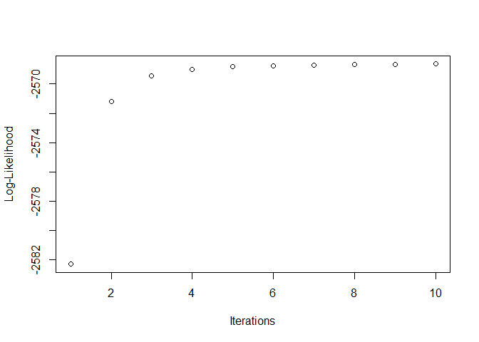

## Installation

You can install R.CenGMR from github with:

``` r
library(devtools)
install_github("GanzhongTian/R.CenGMR")
```

``` r
library(R.CenGMR)
library(matrixStats)
```

    ## Warning: package 'matrixStats' was built under R version 4.1.3

``` r
library(ggplot2)
```

    ## Warning: package 'ggplot2' was built under R version 4.1.3

``` r
library(ggpubr)
```

    ## Warning: package 'ggpubr' was built under R version 4.1.3

# Generate a toy data:

``` r
set.seed(22) 

BETA=list(matrix(c(2,0,20,-2),nrow=2,ncol=2),
          matrix(c(3,1,25,-3),nrow=2,ncol=2),
          matrix(c(3.5,2,30,-5),nrow=2,ncol=2))

SIGMA=list(matrix(c(1,0.1,0.1,1),nrow=2,ncol=2),
           matrix(c(2,0.2,0.2,0.5),nrow=2,ncol=2),
           matrix(c(0.5,0.3,0.3,2),nrow=2,ncol=2))
PIE=c(.1,.7,.2)

message("A vector of Mixing porportions: ")
```

    ## A vector of Mixing porportions:

``` r
print(PIE)
```

    ## [1] 0.1 0.7 0.2

``` r
message("A list of Beta matrices: ")
```

    ## A list of Beta matrices:

``` r
print(BETA)
```

    ## [[1]]
    ##      [,1] [,2]
    ## [1,]    2   20
    ## [2,]    0   -2
    ## 
    ## [[2]]
    ##      [,1] [,2]
    ## [1,]    3   25
    ## [2,]    1   -3
    ## 
    ## [[3]]
    ##      [,1] [,2]
    ## [1,]  3.5   30
    ## [2,]  2.0   -5

``` r
message("A list of Sigma matrices: ")
```

    ## A list of Sigma matrices:

``` r
print(SIGMA)
```

    ## [[1]]
    ##      [,1] [,2]
    ## [1,]  1.0  0.1
    ## [2,]  0.1  1.0
    ## 
    ## [[2]]
    ##      [,1] [,2]
    ## [1,]  2.0  0.2
    ## [2,]  0.2  0.5
    ## 
    ## [[3]]
    ##      [,1] [,2]
    ## [1,]  0.5  0.3
    ## [2,]  0.3  2.0

``` r
example_true_pars=list(PIE,BETA,SIGMA)
names(example_true_pars)=c('PIE','BETA','SIGMA')
#save(example_true_pars,file = "example_true_pars.RData")

example_true=TrueDataGen(1,1000,PIE,BETA,SIGMA)

# Define detection limits
DL=list(c(2.5,10),
        c(0,26.5))

example_censored=CensDataGen(example_true,DL)
```

We can visualize the generated data:

``` r
data=example_true[[1]]
data=cbind(data$Y,data$X,data$Labels)
colnames(data)[5]='Labels'
data=as.data.frame(data)

p1=ggplot(data, aes(x=Y1, y=Y2, color=as.factor(Labels))) +
   geom_point() + scale_color_discrete(name = "True Class")+xlab("True Y1")+ylab("True Y2")+
   lims(x= c(-5,10), y = c(10, 45))+theme(legend.position = "top",text = element_text(size = 20))


p2=ggplot(data, aes(x=X1, y=Y1, color=as.factor(Labels))) +
   geom_point() + scale_color_discrete(name = "True Class")+ylab("True Y1")+
   lims(x= c(-4,4), y = c(-5,10))+theme(legend.position = "top",text = element_text(size = 20))


p3=ggplot(data, aes(x=X1, y=Y2, color=as.factor(Labels))) +
   geom_point() + scale_color_discrete(name = "True Class")+ylab("True Y2")+
   lims(x= c(-4,4), y = c(10,45))+theme(legend.position = "top",text = element_text(size = 20))


data=example_censored[[1]]
data=cbind(data$Y,data$X,data$Labels)
colnames(data)[5]='Labels'
data=as.data.frame(data)

p4=ggplot(data, aes(x=Y1, y=Y2, color=as.factor(Labels))) +
   geom_point() + scale_color_discrete(name = "True Class")+xlab("Observed Y1")+ylab("Observed Y2")+
   lims(x= c(-5,10), y = c(10, 45))+theme(legend.position = "none",text = element_text(size = 20))


p5=ggplot(data, aes(x=X1, y=Y1, color=as.factor(Labels))) +
   geom_point() + scale_color_discrete(name = "True Class")+ylab("Observed Y1")+
   lims(x= c(-4,4), y = c(-5,10))+theme(legend.position = "none",text = element_text(size = 20))


p6=ggplot(data, aes(x=X1, y=Y2, color=as.factor(Labels))) +
   geom_point() + scale_color_discrete(name = "True Class")+ylab("Observed Y2")+
  lims(x= c(-4,4), y = c(10,45))+theme(legend.position = "none",text = element_text(size = 20))


ggarrange(p1,p2,p3,p4,p5,p6, 
          labels = c("A","B","C","D","E","F"),
          ncol = 3, nrow = 2)
```

 \# Modeling using
*MixCensMVReg*

``` r
example_true=example_true[[1]]
example_censored=example_censored[[1]]
```

## Initialize from a given parameter setting

``` r
# Note in this case we do not need to set the number of components G=
# The algorithm will run as long as the length of the inital parameters agree.
# Note how the estimated pies are similar to (0.1,0.7,0.2)
testMV1=MixCenMVReg_EM(Y=example_censored$Y,
                       X=example_censored$X,
                       C=example_censored$censorID, 
                       pie_hat=PIE, beta_hat=BETA, sigma_hat=SIGMA,
                       Max.iter=1000, diff.tol=1e-2, print=T)
```

    ## [1] "The Info matrix for coefficients is not computed"
    ## [1] "Total Iteration = 10"
    ## [1] "Convergence = TRUE"
    ## [1] "LogLik = -2568.644"
    ##      pie1      pie2      pie3 
    ## 0.1055041 0.7017313 0.1927646 
    ## $beta1
    ##            Y1       Y2
    ## X0  1.9929312 20.22026
    ## X1 -0.3095638 -1.92509
    ## 
    ## $beta2
    ##           Y1        Y2
    ## X0 3.0177890 24.984099
    ## X1 0.9178073 -3.017309
    ## 
    ## $beta3
    ##          Y1        Y2
    ## X0 3.570595 30.284829
    ## X1 1.914615 -4.943377
    ## 
    ## $sigma1
    ##           Y1        Y2
    ## Y1 0.9307757 0.1119727
    ## Y2 0.1119727 1.4416285
    ## 
    ## $sigma2
    ##           Y1        Y2
    ## Y1 1.8952608 0.1406214
    ## Y2 0.1406214 0.4350703
    ## 
    ## $sigma3
    ##           Y1        Y2
    ## Y1 0.5025928 0.2717128
    ## Y2 0.2717128 2.0586493



## Initialize from a random initialization

``` r
set.seed(1234) 

testMV2=MixCenMVReg_EM(Y=example_censored$Y,
                       X=example_censored$X,
                       C=example_censored$censorID, 
                       G=3,
                       Max.iter=1000, diff.tol=1e-2, print=T)

# Note that we used a new seed, and the EM converged to a similar solution as testMV1, but with switched labels
```

## Visualization for the output

``` r
data=example_censored
data=cbind(data$Y,data$X,data$Labels)
colnames(data)[5]='Labels'
data=as.data.frame(data)
data$Labels=factor(testMV1$Class) # input the model cluster label.


p7=ggplot(data, aes(x=Y1, y=Y2, color=as.factor(Labels))) +
   geom_point() + scale_color_discrete(name = "GMR")+xlab("Observed Y1")+ylab("Observed Y2")+
   lims(x= c(-5,10), y = c(10, 45))+theme(legend.position = "top",text = element_text(size = 15))


p8=ggplot(data, aes(x=X1, y=Y1, color=as.factor(Labels))) +
   geom_point() + scale_color_discrete(name = "GMR")+ylab("Observed Y1")+
   lims(x= c(-4,4), y = c(-5,10))+theme(legend.position = "top",text = element_text(size = 15))


p9=ggplot(data, aes(x=X1, y=Y2, color=as.factor(Labels))) +
   geom_point() + scale_color_discrete(name = "GMR")+ylab("Observed Y2")+
  lims(x= c(-4,4), y = c(10,45))+theme(legend.position = "top",text = element_text(size = 15))

ggarrange(p7,p8,p9,ncol=3)
```


## Predict the probability of each group with Y1, Y2 and X.

``` r
input=data.frame(Y1=5,Y2=20,X=2)
Y=t(as.matrix(c(input$Y1,input$Y2))) 
C=Y*0
# the limit for Ab42 is (200,1700)
if(Y[1,1]==2.5){C[1,1]=-1} else if(Y[1,1]==10) {c[1,1]=1}

# the limit for tTau is (80,   )
if(Y[1,2]==0){C[1,2]=-1} else if(Y[1,2]==26.5) {c[1,2]=1}


X=t(as.matrix(c(1,input$X))) # dimension 1 x 2

G=length(testMV1$Pie)

log.ind_density=matrix(NA,nrow=1,ncol=G)
mu_hat=list()


for(g in 1:G){
  mu_hat[[g]]=as.numeric(X)%*%testMV1$Beta[[g]] #Linear regression model to use covariates to predict the miu for the two biomarkers, dimension 1 x 2 
  log.ind_density[,g]=log(testMV1$Pie[g])+eval_density(Y,C,mu_hat[[g]],testMV1$Sigma[[g]])
}

p=exp(sweep(log.ind_density, 1, apply(log.ind_density,1,logSumExp)))
colnames(p)=c("Class 1","Class 2","Class 3")
p=t(as.matrix(p[, order(colnames(p))]))

print(p)
```

    ##           Class 1   Class 2     Class 3
    ## [1,] 1.008695e-05 0.9976219 0.002368041
